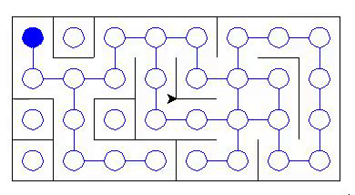
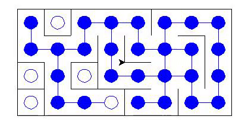

# 🧱 Labyrinthe

## 📄 Description

Labyrinthe est le dernier mini-projet réalisé dans le cadre de l'enseignement de NSI en Termianle. Il consiste à simuler le parcours d'un Labyrinthe en utilisant le module turtle sous Python.

voici l'énoncé :

Rechercher le chemin le plus court/le plus long entre deux stations dans le métro.Indépendamment de l'aspect ludique, c'est en fait un problème difficile qu'on aurait bien du mal à résoudre de façon raisonnable sur un gros graphe
comme celui du métro. Pour simplifier, nous allons donc considérer des labyrinthes.

Il s'agit d'un TP plutôt guidé, avec turtle imposé.

## 🖼 Images

### Création du labyrinthe


### Parcours des Noeuds



### Tracé d'un chemin possible vers la sortie



## Installation

### Téléchargement

Vous pouvez télécharger le code sous format `.ZIP` ou bien en clonant le projet dans le répertoire actuel :

En https :

```sh
git clone https://github.com/Taliayaya/Labyrinthe.git
```

En ssh :

```sh
git clone git@github.com:Taliayaya/Labyrinthe
```

### Prérequis

Python doit impérativement être installé. Dans une console, placez-vous dans le répertoire du projet. Lancez l'instruction

```sh
pip install .
```

ou son équivalent

```sh
python3 -m pip install .
```

ou bien

```sh
make init
```

### Lancer le simulateur

Lancez l'instruction :

```sh
python3 labyrinthe/
```

ou bien

```sh
make run
```

## Crédits

Travaille en binôme réalisé avec Irène Fioc

## Licences

Copyright © 2022-présent, Ilan Mayeux et Irène Fioc.
Ce projet est sous licence GNU
